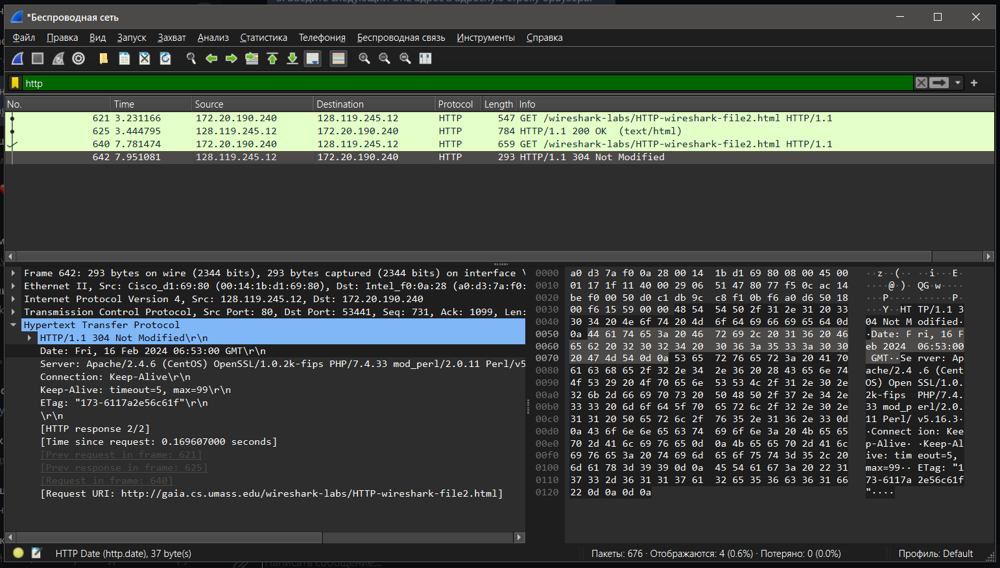

# Практика 1. Wireshark: HTTP
Эта работа исследует несколько аспектов протокола HTTP: базовое взаимодействие GET/ответ,
форматы сообщений HTTP, получение больших файлов HTML, получение файлов HTML со
встроенными объектами, а также проверку подлинности и безопасность HTTP.

Во всех заданиях (а также во всех следующих лабах) предполагается, что вы к своему ответу 
приложите **подтверждающий скрин** программы Wireshark (достаточно одного скрина на задание).

## Задание 1. Базовое взаимодействие HTTP GET/response (2 балла)

<image src="/images/Задание 1.1.png" alt="Текст с описанием картинки">

1. Использует ли ваш браузер HTTP версии 1.0 или 1.1? Какая версия HTTP работает на
   сервере?
   - 1.1
   - 1.1

2. Какие языки (если есть) ваш браузер может принимать? В захваченном сеансе какую еще
   информацию (если есть) браузер предоставляет серверу относительно пользователя/браузера?
   - Русский, английский. (ru-RU,ru;q=0.9,en-US;q=0.8,en;q=0.7) 
   - User-Agent: про браузер и платформу, на которой запущен браузер(через / версии); Accept: какие типы контента клиент может понять; Accept-Encoding: какую кодировку контента клиент может понять; Upgrade-Insecure-Requests: сигнализирует серверу о том, что он поддерживает механизмы обновления upgrade-insecure-requests

3. Какой IP-адрес вашего компьютера? Какой адрес сервера gaia.cs.umass.edu?
   - 172.20.190.240
   - 128.119.245.12

4. Какой код состояния возвращается с сервера на ваш браузер?
   - 200 (OK)
   
5. Когда HTML-файл, который вы извлекаете, последний раз модифицировался на сервере?
   - Fri, 16 Feb 2024 06:52:01 GMT
   
6. Сколько байтов контента возвращается вашему браузеру?
   - 128

## Задание 2. HTTP CONDITIONAL GET/response (2 балла)

1. Проверьте содержимое первого HTTP-запроса GET. Видите ли вы строку «IF-MODIFIED-SINCE» в HTTP GET?
   - Нет.
   
2. Проверьте содержимое ответа сервера. Вернул ли сервер содержимое файла явно? Как вы
   это можете увидеть?
   - Да
   - Есть поля про содержимое, как например Content-Length, Content-Type. Ну и File Data
   
3. Теперь проверьте содержимое второго HTTP-запроса GET (из вашего браузера на сторону
   сервера). Видите ли вы строку «IF-MODIFIED-SINCE» в HTTP GET? Если да, то какая
   информация следует за заголовком «IF-MODIFIED-SINCE»?
   - Да, там дата из Last-Modified поля первого ответа сервера: Fri, 16 Feb 2024 06:52:01 GMT
   
4. Какой код состояния HTTP и фраза возвращаются сервером в ответ на этот второй запрос
   HTTP GET? Вернул ли сервер явно содержимое файла?
   - 304 Not Modified
   - Нет

## Задание 3. Получение длинных документов (2 балла)

1. Сколько сообщений HTTP GET отправил ваш браузер? Какой номер пакета в трассировке
   содержит сообщение GET?
   - 1
   - 282
2. Какой номер пакета в трассировке содержит код состояния и фразу, связанные с ответом
   на HTTP-запрос GET?
   - 314
3. Сколько сегментов TCP, содержащих данные, потребовалось для передачи одного HTTP ответа?
   - 3
4. Есть ли в передаваемых данных какая-либо информация заголовка HTTP, связанная с
   сегментацией TCP?
   - Нет

## Задание 4. HTML-документы со встроенными объектами (2 балла)

1. Сколько HTTP GET запросов было отправлено вашим браузером? На какие интернет-адреса были отправлены эти GET-запросы?
   - 3
   - gaia.cs.umass.edu (128.119.245.12), gaia.cs.umass.edu (128.119.245.12), kurose.cslash.net (178.79.137.164)
2. Можете ли вы сказать, загрузил ли ваш браузер два изображения последовательно или
   они были загружены с веб-сайтов параллельно? Объясните.
   - Думаю, что последовательно, так как по номерам пакетов мы сначала запросили первую картинку, получили ответ и только потом отправили запрос для получения второй картинки.

## Задание 5. HTTP-аутентификация (2 балла)

1. Каков ответ сервера (код состояния и фраза) в ответ на начальное HTTP-сообщение GET от вашего браузера?
   - 401 Unauthorized
2. Когда ваш браузер отправляет сообщение HTTP GET во второй раз, какое новое поле включается в сообщение HTTP GET?
   - Authorization (и ещё Cache-Control на самом деле)
