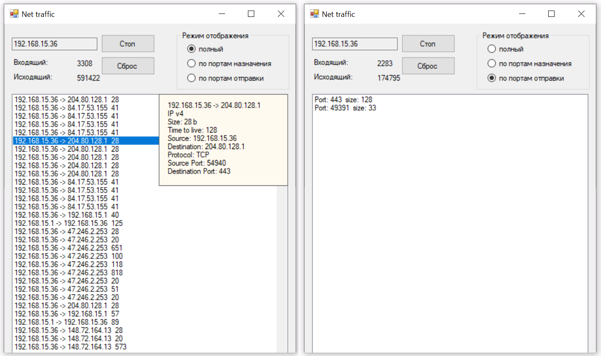
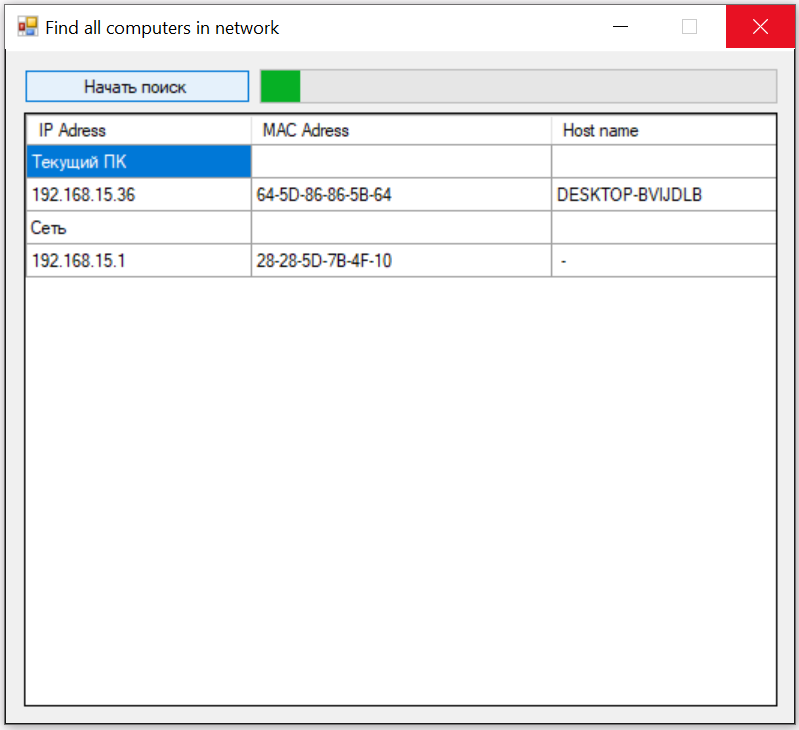

# Практика 13. Канальный уровень

## Wireshark: DHCP (4 балла)
DHCP обеспечивает динамическое присваивание IP-адресов хостам.

#### Подготовка
1. Из командной строки запустите `ipconfig /release` (В Windows исполняемый файл команды
ipconfig находится в каталоге C:\windows\system32). Эта команда высвобождает ваш
актуальный IP-адрес, и IP-адрес вашего хоста становится равен 0.0.0.0.
2. Запустите анализатор пакетов Wireshark
3. Теперь вернитесь к командной строке Windows и введите ipconfig /renew. Эта команда
позволит вашему хосту получить сетевую конфигурацию, в частности, новый IP-адрес.
Дождитесь, пока команда ipconfig /renew завершит работу.
4. Чтобы просмотреть только DHCP-пакеты, введите в поле фильтра значение bootp.
(Протокол DHCP разработан на базе более старого протокола BOOTP)
При ответе на вопросы представьте соответствующие скрины.

#### Вопросы
1. Поверх какого протокола посылаются сообщения DHCP – UDP или TCP?
   - <!-- todo -->
2. Каков адрес канального уровня (т.е., Ethernet-адрес) у вашего хоста?
   - <!-- todo -->
3. Каковы значения Transaction-ID в наборе (Request/ACK) DHCP-сообщений? Опишите
   назначение поля Transaction-ID.
   - <!-- todo -->
4. Хост использует DHCP-протокол, в частности, для получения IP-адреса. Но IP-адрес хоста
   остается неподтвержденным до завершения обмена DHCP сообщениями. Если IP-адрес не
   установлен до завершения обмена сообщениями, то какие значения используются в 
   IP-дейтаграммах при обмене этими сообщениями? Укажите исходный и конечный IP-адреса,
   передаваемые в инкапсулирующей IP-дейтаграмме DHCP сообщений
   - <!-- todo -->
5. Каков IP-адрес вашего DHCP-сервера?
   - <!-- todo -->
6. Объясните назначение срока аренды IP-адреса. Какова длительность срока аренды в
   вашем эксперименте?
   - <!-- todo -->

## Программирование

### Проверка целостности пакетов (4 балла)
Реализуйте проверку целостности пакетов на основе кодов циклического контроля (Cyclic
Redundancy Check, CRC).

Реализуйте тесты, показывающие корректность работы вашего решения. Для этого
предусмотрите возможность внесения ошибки (искажения) в одном или нескольких битах
данных.

Сценарий для основного теста: вводится текст, который разбивается на пакеты длинной 5 байт
(полезные данные), в некоторых из пакетов возникает ошибка (искусственная: искажение
отдельных битов). Вы должны определить, в каких пакетах возникла ошибка. Для каждого пакета
выведите на экран: полезные передаваемые данные, пакет в закодированном виде, контрольный
код.

### Подсчет сетевого трафика (8 баллов)

### Задание А (2 балла)
Разработать приложение, подсчитывающее входящий и исходящий сетевой трафик без учета
его природы.

#### Демонстрация работы
todo

### Задание Б (2 балла)
Разработать приложение, подсчитывающее входящий и исходящий сетевой трафик с учетом
приложения (порта), для которого данный трафик предназначен. Приложение должно
формировать отчет с разделением трафика по портам назначения/отправки.

#### Демонстрация работы
todo

### Задание В (4 балла)
Разработать приложение, анализирующее весь сетевой трафик подсети. Приложение должно
перехватывать не только трафик, адресованный данному узлу, но и анализировать пакеты,
адресованные другим узлам сети.

При выделении записи в списке должна всплывать подсказка (hint) с более подробной
информацией: транспортный протокол (TCP/UDP), версия IP протокола, порт отправителя, порт
получателя, размер переданных данных, адреса отправителя и получателя.

Пример GUI приложения:

Приложение поддерживает три режима работы: отображение полного списка всех
проходящих пакетов с суммированием входящего и исходящего трафика (при нажатии на пакет в
списке выводится подробная информация); отображение суммарного входящего и исходящего
трафика по портам. 

#### Демонстрация работы
todo

### Определение всех компьютеров в сети (6 баллов)

### Задание А (4 балла)
Создайте приложение, определяющее все компьютеры (IP-адрес, MAC-адрес и имя), находящиеся
в данной сети. Компьютеры в сети находятся с использованием заданной маски (например,
255.255.255.0).

Выведите информацию о найденных компьютерах на экран. Первой строкой должны выводиться
данные о вашем компьютере в этой сети. 

#### Демонстрация работы
todo

### Задание Б (2 балла)
Создайте GUI для программы из Задания А, в котором есть progress bar, показывающий то,
сколько еще осталось проверить IP-адресов. Вы можете объединить решения Задания А и Б в
одном приложении.

Пример GUI приложения:

#### Демонстрация работы
todo

## Задачи

### Задача 1. (2 балла)
Вывод значения эффективности дискретного протокола ALOHA.
1. При наличии $N$ активных узлов эффективность дискретного протокола ALOHA равна 
   $N \cdot p (1 - p)^{N - 1}$. Найдите значение $p$, максимизирующее результат этого выражения.
2. Воспользовавшись значением $p$, найденным в пункте (1), найдите эффективность дискретного
протокола ALOHA, когда $N$ стремится к бесконечности.

#### Решение
todo

### Задача 2 (3 балла)
Предположим, у нас имеются четыре активных узла – A, Б, В и Г – конкурирующих за доступ к
каналу с применением дискретного протокола ALOHA. Допустим, у каждого узла есть
бесконечное количество пакетов для отправки. Каждый узел пытается передать свой пакет в
каждом кванте времени с вероятностью 𝑝. Первый квант имеет номер 1, второй – номер 2 и т.д.
1. Какова вероятность, что узлу A с первого раза удастся передать информацию в кванте 5?
2. Какова вероятность, что какому-либо другому узлу (Б, В или Г) с первого раза удастся
передать информацию в кванте 4?
3. Какова вероятность, что первая успешная передача произойдет в кванте 3?
4. Какова эффективность этой системы, состоящей из четырех узлов?

#### Решение
todo

### Задача 3 (2 балла)
Рассмотрим широковещательный канал с $N$ узлами и скоростью передачи данных $R$ бит/с.
Предположим, что в этом широковещательном канале используется опрос (опрос
выполняется отдельным узлом) для множественного доступа. Допустим, что количество
времени, за которое узел осуществляет передачу данных до соседнего узла (то есть, задержка
при опросе) составляет $d_{\text{опрос}}$. Также будем исходить из того, что в каждом раунде опроса
конкретному узлу разрешается передавать не более $Q$ бит. Какова будет максимальная
пропускная способность широковещательного канала?

#### Решение
todo
